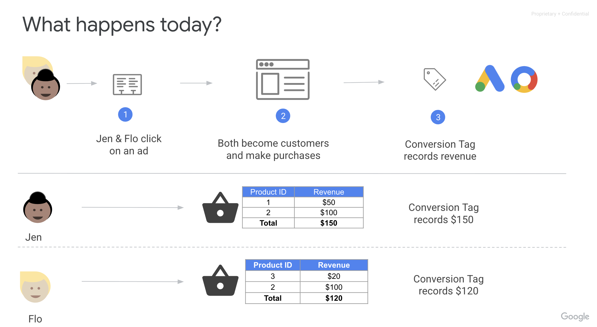
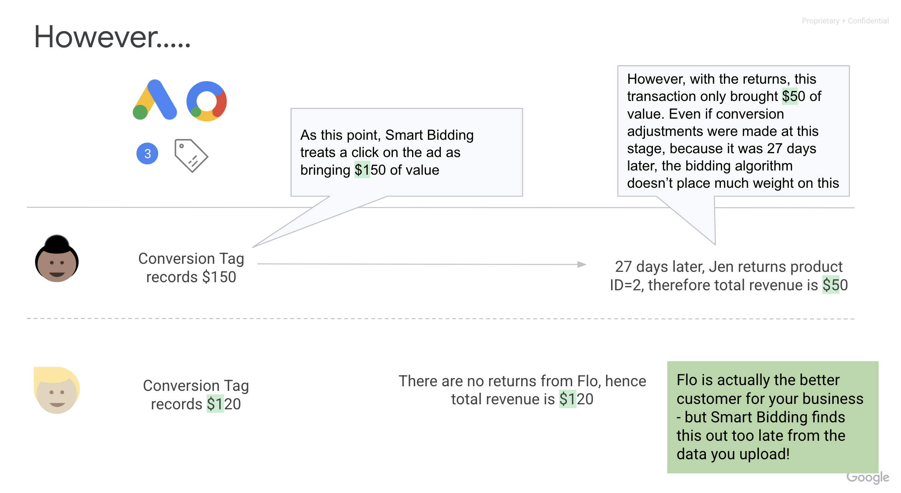
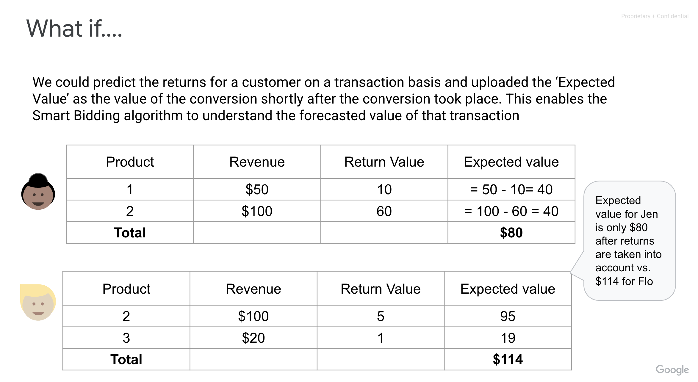
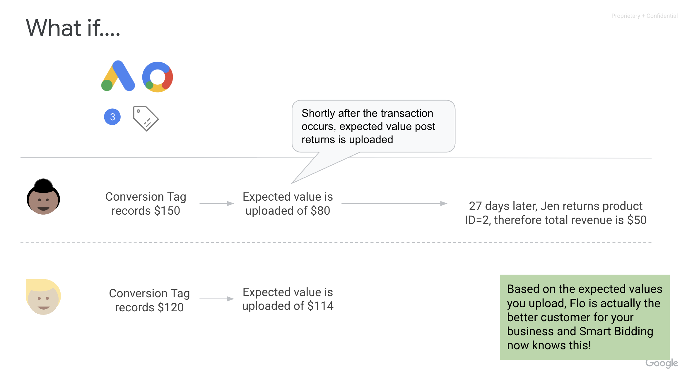
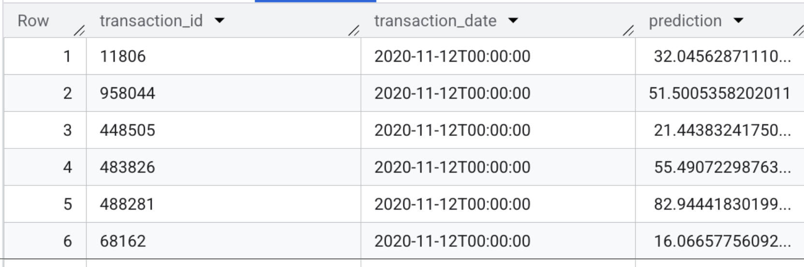
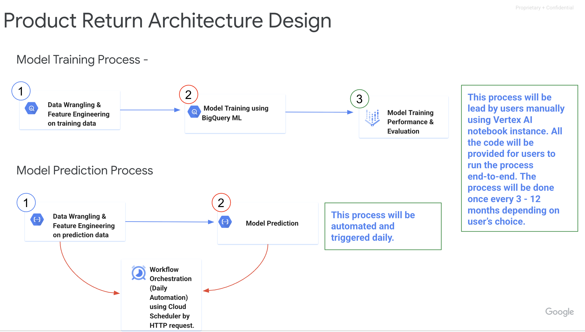

# Product Return Predictor
**Disclaimer: This is not an official Google product.**

[Overview](#problem-statement) •
[Objective](#objective) •
[Solution Overview](#solution-overview) •
[Related Work](#related-work) •
[Advertiser Requirement](#advertiser-requirement-for-running-the-solution) •
[Infrastructure Design on Google Cloud Platform](#infrastructure-design-on-google-cloud-platform) •
[Detailed Design](#detailed-design) •
[Data Requirements](#data-requirements) •
[Feature Engineering](#feature-engineering) •
[Model Training and Refresh](#model-training-and-refresh) •
[Prediction and Activation](#prediction-and-activation) •
[Implementation Guide](#implementation-guide)

## Problem Statement
We want to help retailers reduce the rate of customers returning their products,
to increase sustainability and profit.
A product can be returned for various reasons, including quality and size
issues. There are also challenges such as “wardrobing” which is where customers
purchase an item with the intention of returning it once it has been used for a
specific purpose.

## Objective
To address the return issue for our retail advertisers, the product return
solution leverages machine learning to predict refund value at transaction
level. The solution aims to predict product refund amounts to adjust the
conversion value for a given transaction/order to make sure our advertisers are
spending the “right” amount of investment in targeting the “right” customers.

To activate the solution, we can upload adjusted basket value/conversion value
based on predicted return to Google Ads Smart Bidding.

**Below illustrates the problem statements and how we need to solve it**

<br>

<br>

<br>

<br>

## Solution Overview
The product return predictor solution is an end-to-end model training and
prediction pipeline, leveraging GA4 (Google Analytics) data export on BigQuery
and deployed on Google Cloud Platform (GCP).

To implement the solution:
Users need to create a Vertex AI notebook instance on Vertex AI workbench and
clone the `product_return_predictor` package from to run through both the
training and prediction pipelines.

```
git clone https://github.com/google-marketing-solutions/product-return-predictor.git
```

**The final outputs of the solution are:**

- Pre-trained product return predictive model that predict the predicted refund value of transactions from the the model training pipeline.

- The prediction data saved in BigQuery table for refund prediction with transaction date, transaction id and refund value prediction.

  - Here’s the example of how the prediction table would look like:

<br>

**The pipeline includes two parts: model training and prediction.**

The **model training** part provides functions leveraging SQL and Python code
for data wrangling, feature engineering, model training and model evaluation.
The **prediction** part provides functions for feature engineering and
prediction.

**Below are the main features of the solution:**

- **Privacy-safe solution leveraging 1st Party data:** Our product return
predictor model leverages 1st Party - mainly GA4 data export on BigQuery (and
other data sources/tables available on BigQuery if needed).
- **Machine Learning model for prediction**: To predict product refund value
for each transaction, we are using a machine learning model on GCP (BigQueryML)
to predict the future refund value of a transaction before the end of the return
policy window (before the transaction is no longer eligible for return).
- **Full automation for model training & prediction process**: The whole system
is orchestrated by a single cloud function that listens to entries in our logs
table and effectively coordinates a status machine, triggering the appropriate
query in the sequence.
- **Simple deployment that can scale across brands and markets**: The entire
solution is designed and developed to enable our advertisers to deploy their
product return model on GCP in a scalable and efficient manner. This means
advertisers/users are expected to install our solution and provide a few input
& adjustments to fully leverage the solution for their own business.

## Related work
The predictive modeling framework is very similar to those used by
[crystalvalue] (https://github.com/google/crystalvalue) used for predicting
customer lifetime value and purchase propensity.

**The biggest difference between crystalValue and Product Return Predictor is:**

- Crystalvalue is designed and used to predict customer lifetime value (LTV)
while Product Return Predictor is used to predict return value.
- crystalvalue uses AutoML while Product Return Predictor uses BigQuery ML for
model training.
- Compared with Crystalvalue which uses simple features, Product Return
Predictor provides SQL queries that create more comprehensive features based on
GA4 data for predictive model.

## Advertiser Requirement for running the solution

- Retail advertisers who are suffering from high return rate for their business.

- Advertisers who are using value based bidding.

- Advertisers who are open to using adjusted conversion value (calculated based on refund value prediction from the predictive model).

-   Google Cloud Platform users - the following components on GCP are being used
    for the project:
    -   **BigQuery (including BigQuery ML)**: The solution heavily relies on
        BigQuery for data storage, processing, and model training. All the SQL
        code is built using BigQuery SQL Syntax. To use environment other than
        GCP and BigQuery, you would need to do the data wrangling and
        preprocessing on your own and then migrate your data to BigQuery.
    -   **Vertex AI -> Workbench -> Notebook Instances**: The solution is
        designed to be run on a Vertex AI notebook instance. The syntax used
        for model training and prediction is built using BigQuery ML. If you
        are not using Vertex AI workbench or BigQuery ML for model training and
        prediction, it would be very difficult re-use the solution.
    -   **Cloud Storage Bucket**: The solution uses Cloud Storage to store
        intermediate files and trained pipelines. If you are not using Cloud
        Storage, you would need to adjust the code to use your own storage
        solution.

## Solution Workflow Details
Two components of the overall process of product return predictor on Google
Cloud Platform (GCP):

- **[Model Training]** Use historical data to train predictive product return
models using BQML & Vertex AI workbench. The model training process is done
using a user-managed notebook instance on VertexAI workbench. The process is
done once every 3 - 12 months depending on how often the user is planning to
refresh their predictive model.

  **The process entails the following steps:**

  - Data Wrangling & Feature Engineering on training dataset
  - Model Training
  - Model Performance Evaluation using training and validation datasets
  - Trained model will be saved on BigQuery

- **[Model Prediction]** Use saved models trained during the model training
phase for prediction. The predicted transaction level refund value is produced
during this process and saved in the BigQuery table for activation on a daily
basis. Cloud function is used to complete the following steps. Cloud Scheduler
is used to schedule daily predictions.

  **The process entails the following steps:**
  - Data Wrangling & Feature Engineering on prediction dataset (using cloud
  function)
  - Model Prediction (using ML.predict on BigQuery ML)

## Infrastructure Design on Google Cloud Platform
<br>

## Detailed design
The main components of the projects are model training pipeline and prediction
pipeline:

- **[Model Training: every 3-12 months Depending how often the user wants
refresh their predictive model]**
  - **Data Engineering**: Creating model training dataset (stored on BigQuery)
  - **Data Sanity check + Feature Selection**: Data cleanup and selection of
  features via Python Cloud Function (stored on BigQuery).
  - **Model Training Validation and Hyper Parameter tuning**: Use BQML Train and
  validate models on the validation set (20%). Determine which model is the
  best. (Keep log of best performing model for each run of the Model Training
  pipeline).
  - **Model Evaluation**: Predict 10% of latest transactions and produce
  estimated output. Report on Cloud Storage that users can do their own check.
  - **3 target variables considered:**

      1. **refund value** = amount returned to the customer
      2. **refund value proportion** = refund value / transaction value (%
      value)
      3. **refund value flag + refund value**: Create binary classification and
      for transactions with refund value, train a regression model to predict
      refund value

- **[Model Prediction: Daily]**
  - **Data Engineering**: Creating model prediction dataset (stored on
  BigQuery).
  - **Prediction Data Transformation**: Retrieve best performing model from Logs
  table and which are the features being used.
  - **Prediction**: Use Best Performing model to produce prediction.
  - **Data Activation**: Upload to Google Ads the data from BigQuery for offline
  conversion value export ([check OCA - Offline Conversions Adjustment](https://developers.google.com/google-ads/api/docs/conversions/upload-adjustments#python)).

## Data Requirements
**The solution facilitates using GA4 data for feature engineering.**

**Below are the components of the main sources used for the solution from GA4:**

- Transaction id, item id, user/customer id level transaction date & value,
return date & value.
- Item metadata: Item id level product information including pricing, material,
color, brand, category, etc.
- Customer/user metadata: device type, country, gender, etc.
- Transaction id, session id level web activity data (e.g. sessions, time spent
on site, pageviews, etc.)

**If GA4 data export is not being used**:

You need to provide your own preprocessed data for model training and prediction. In this case, here’s the data requirement for the preprocessed training and prediction tables:

- Both tables need to be aggregated at transaction_id and transaction_date level.
- Both tables need to have the following field:
  - **transaction_id**: unique identifier for the order.
  - **transaction_date**: datetime field that indicates when the transaction took
    place.
- The table used in the ML training pipeline needs to have the following fields as labels (target variables):
  - **refund_value**: monetary value of the transaction that get refunded. (e.g. if
    a transaction has $100 transaction value, two items with transaction value
    of $50 in total have been refunded, then in this case the refund value
    should be $50)
  - **refund_flag**: whether the transaction has been refunded (“0” as no refund,
    “1” as refunded). Note: for partial refund, we will still label the field
    as “1”.
  - **Refund_proportion**: monetary value proportion of the transaction that got
    refunded. In the previous example it would be 50/100 = 0.5.
- Prediction table should have the same feature set as the training table.

## Feature Engineering

When training the model, the product return predictor splits the data into two
kinds based on user status:

-   First-time users: users that made a purchase for the first time
-   Existing users/customers: customers that have already made at least one
    purchase in the past and are traceable via user id on GA4

For the first type of users, we are focusing on creating features related to the
current transaction.

For the second type of users, on top of the features related to the current
transaction, we can also create features that describe the past user behavior
(e.g. past user return rate, past user return rate for a particular type of
item, past user number of transactions and total transaction value, etc.)

**Below are the features for the first-time users**:

| Feature Name                      | Feature Type                                      | Feature Description                                                                                                                                              |
| :-------------------------------- | :------------------------------------------------ | :------------------------------------------------------------------------------------------------------------------------------------------------------- |
| `transaction_id`                  | Primary Key                                       | Unique identifier for each transaction.                                                                                                                  |
| `transaction_date`                | Primary Key                                       | Date and time when the transaction occurred.                                                                                                             |
| `refund_value`                    | Current Transaction Info (Shopping Cart Info)     | The monetary amount of any refund associated with the transaction.                                                                                       |
| `refund_flag`                     | Current Transaction Info (Shopping Cart Info)     | Indicates if the transaction involved a refund (True/False).                                                                                             |
| `refund_proportion`               | Current Transaction Info (Shopping Cart Info)     | The proportion of the original transaction value that was refunded.                                                                                      |
| `transaction_value`               | Current Transaction Info (Shopping Cart Info)     | The total monetary value of the transaction.                                                                                                             |
| `shipping_value`                  | Current Transaction Info (Shopping Cart Info)     | The monetary value of shipping costs for the transaction.                                                                                                |
| `item_count`                      | Current Transaction Info (Shopping Cart Info)     | The total number of distinct items purchased in the transaction.                                                                                         |
| `unique_item_id_count`            | Current Transaction Info (Shopping Cart Info)     | The count of unique item IDs in the transaction.                                                                                                         |
| `unique_item_name_count`          | Current Transaction Info (Shopping Cart Info)     | The count of unique item names in the transaction.                                                                                                       |
| `unique_item_category_count`      | Current Transaction Info (Shopping Cart Info)     | The count of unique item categories in the transaction.                                                                                                  |
| `unique_item_brand_count`         | Current Transaction Info (Shopping Cart Info)     | The count of unique item brands in the transaction.                                                                                                      |
| `min_price`                       | Current Transaction Info (Shopping Cart Info)     | The minimum price of an item within the transaction.                                                                                                     |
| `max_price`                       | Current Transaction Info (Shopping Cart Info)     | The maximum price of an item within the transaction.                                                                                                     |
| `avg_price`                       | Current Transaction Info (Shopping Cart Info)     | The average price of items within the transaction.                                                                                                       |
| `std_price`                       | Current Transaction Info (Shopping Cart Info)     | The standard deviation of item prices within the transaction.                                                                                            |
| `min_item_revenue`                | Current Transaction Info (Shopping Cart Info)     | The minimum revenue generated by a single item in the transaction.                                                                                       |
| `max_item_revenue`                | Current Transaction Info (Shopping Cart Info)     | The maximum revenue generated by a single item in the transaction.                                                                                       |
| `avg_item_revenue`                | Current Transaction Info (Shopping Cart Info)     | The average revenue generated by items in the transaction.                                                                                               |
| `std_item_revenue`                | Current Transaction Info (Shopping Cart Info)     | The standard deviation of item revenues within the transaction.                                                                                          |
| `min_item_quantity`               | Current Transaction Info (Shopping Cart Info)     | The minimum quantity of a single item purchased in the transaction.                                                                                      |
| `max_item_quantity`               | Current Transaction Info (Shopping Cart Info)     | The maximum quantity of a single item purchased in the transaction.                                                                                      |
| `avg_item_quantity`               | Current Transaction Info (Shopping Cart Info)     | The average quantity of items purchased within the transaction.                                                                                          |
| `std_item_quantity`               | Current Transaction Info (Shopping Cart Info)     | The standard deviation of item quantities within the transaction.                                                                                        |
| `discounted_product_count`        | Current Transaction Info (Shopping Cart Info)     | The number of products in the transaction that were discounted.                                                                                          |
| `max_same_item_item_quantity`     | Current Transaction Info (Shopping Cart Info)     | Maximum quantity of a specific item (same item ID) within the transaction.                                                                               |
| `min_same_item_item_quantity`     | Current Transaction Info (Shopping Cart Info)     | Minimum quantity of a specific item (same item ID) within the transaction.                                                                               |
| `avg_same_item_item_quantity`     | Current Transaction Info (Shopping Cart Info)     | Average quantity of a specific item (same item ID) within the transaction.                                                                               |
| `same_item_in_transaction_flag`   | Current Transaction Info (Shopping Cart Info)     | Indicates if multiple instances of the same item were in the transaction.                                                                                |
| `max_same_item_variant_quantity`  | Current Transaction Info (Shopping Cart Info)     | Maximum quantity of a specific item variant within the transaction.                                                                                      |
| `min_same_item_variant_quantity`  | Current Transaction Info (Shopping Cart Info)     | Minimum quantity of a specific item variant within the transaction.                                                                                      |
| `avg_same_item_variant_quantity`  | Current Transaction Info (Shopping Cart Info)     | Average quantity of a specific item variant within the transaction.                                                                                      |
| `same_item_variant_in_transaction_flag` | Current Transaction Info (Shopping Cart Info) | Indicates if multiple instances of the same item variant were in the transaction.                                                                        |
| `calculated_past_product_refund_rate` | Past Refund Stats                         | Historical refund rate for the product involved in the transaction. Calculation used: SAFE_DIVIDE((SUM(same item past refund count) + AVG(overall past refund rate) * 0.2), (SUM(same item past transaction count) + 0.2)) |
| `calculated_past_product_refund_amt_proportion` | Past Refund Stats                 | Historical proportion of refund amount for the product. Calculation used: SAFE_DIVIDE((SUM(same item past refund value) + AVG(overall past refund value proportion) * 0.2), (SUM(same item past transaction value) + 0.2)) |
| `calculated_past_brand_refund_amt_proportion` | Past Refund Stats                 | Historical proportion of refund amount for the brand of the product. Calculation used: SAFE_DIVIDE((SUM(same brand past refund amount) + AVG(overall past refund proportion) * 0.2), (SUM(same brand past transaction amount) + 0.2)) |
| `calculated_past_brand_refund_rate` | Past Refund Stats                         | Historical refund rate for the brand of the product. Calculation used: SAFE_DIVIDE((SUM(same brand past refund count) + AVG(overall past refund rate) * 0.2), (SUM(same brand past transaction count) + 0.2)) |
| `calculated_past_category_refund_amt_proportion` | Past Refund Stats                 | Historical proportion of refund amount for the product's category. Calculation used: SAFE_DIVIDE((SUM(same brand past refund amount) + AVG(overall past refund proportion) * 0.2), (SUM(same brand past transaction amount) + 0.2)) |
| `calculated_past_category_refund_rate` | Past Refund Stats                       | Historical refund rate for the product's category. Calculation used: SAFE_DIVIDE((SUM(same category past refund count) + AVG(overall past refund rate) * 0.2), (SUM(same category past transaction count) + 0.2)) |
| `country`                         | Current Web Session Info                  | The country from which the transaction or event originated.                                                                                              |
| `city`                            | Current Web Session Info                  | The city from which the transaction or event originated.                                                                                                 |
| `device_category`                 | Current Web Session Info                  | The type of device used (e.g., mobile, desktop, tablet).                                                                                                 |
| `operating_system`                | Current Web Session Info                  | The operating system of the device used.                                                                                                                 |
| `languages`                       | Current Web Session Info                  | The language setting of the user's device or browser.                                                                                                    |
| `session_length_in_seconds`       | Current Web Session Info                  | The duration of the user's session in seconds.                                                                                                           |
| `website_engaged_sessions`        | Current Web Session Info                  | The number of engaged sessions on the website.                                                                                                           |
| `web_traffic_engagement_time_seconds` | Current Web Session Info              | Total time (in seconds) the user spent engaged with web content.                                                                                         |
| `web_traffic_campaign`            | Current Web Session Info                  | The marketing campaign associated with the web traffic.                                                                                                  |
| `web_traffic_medium`              | Current Web Session Info                  | The medium through which the web traffic arrived (e.g., organic, CPC).                                                                                   |
| `web_traffic_source`              | Current Web Session Info                  | The source of the web traffic (e.g., google, direct).                                                                                                    |
| `web_traffic_channel_grouping_user` | Current Web Session Info              | The default channel grouping for the user's traffic.                                                                                                     |
| `event_length_by_event_name`      | Current Web Session Info                  | The length/duration of a specific event type. For creating fields with this naming convention, we list out all the unique event names and create a pivot table to get the event length for a particular event name. |
| `event_count_by_event_name`       | Current Web Session Info                  | The count of a specific event type. For creating fields with this naming convention, we list out all the unique event names and create a pivot table to get the event count for a particular event name. |
| `past_3_days_transaction_value`   | Recent historical refund & transaction stats (used for capturing seasonality) | Sum of transaction values in the past 3 days for the user/entity.                                                                                        |
| `past_3_days_refund_value`        | Recent historical refund & transaction stats (used for capturing seasonality) | Sum of refund values in the past 3 days for the user/entity.                                                                                             |
| `past_3_days_refund_proportion`   | Recent historical refund & transaction stats (used for capturing seasonality) | Proportion of refund value to transaction value in the past 3 days.                                                                                      |
| `past_7_days_transaction_value`   | Recent historical refund & transaction stats (used for capturing seasonality) | Sum of transaction values in the past 7 days for the user/entity.                                                                                        |
| `past_7_days_refund_value`        | Recent historical refund & transaction stats (used for capturing seasonality) | Sum of refund values in the past 7 days for the user/entity.                                                                                             |
| `past_7_days_refund_proportion`   | Recent historical refund & transaction stats (used for capturing seasonality) | Proportion of refund value to transaction value in the past 7 days.                                                                                      |
| `past_30_days_transaction_value`  | Recent historical refund & transaction stats (used for capturing seasonality) | Sum of transaction values in the past 30 days for the user/entity.                                                                                       |
| `past_30_days_refund_value`       | Recent historical refund & transaction stats (used for capturing seasonality) | Sum of refund values in the past 30 days for the user/entity.                                                                                            |
| `past_30_days_refund_proportion`  | Recent historical refund & transaction stats (used for capturing seasonality) | Proportion of refund value to transaction value in the past 30 days.                                                                                     |

**Below are the features for the existing users (non first-time purchasers)**:

| Feature Name                                  | Feature Type                                      | Feature Description                                                                                                                                              |
| :-------------------------------------------- | :------------------------------------------------ | :------------------------------------------------------------------------------------------------------------------------------------------------------- |
| `transaction_id`                              | Primary Key                                       | Unique identifier for each transaction.                                                                                                                  |
| `transaction_date`                            | Primary Key                                       | Date and time when the transaction occurred.                                                                                                             |
| `refund_value`                                | Current Transaction Info (Shopping Cart Info)     | The monetary amount of any refund associated with the transaction.                                                                                       |
| `refund_flag`                                 | Current Transaction Info (Shopping Cart Info)     | Indicates if the transaction involved a refund (True/False).                                                                                             |
| `refund_proportion`                           | Current Transaction Info (Shopping Cart Info)     | The proportion of the original transaction value that was refunded.                                                                                      |
| `transaction_value`                           | Current Transaction Info (Shopping Cart Info)     | The total monetary value of the transaction.                                                                                                             |
| `shipping_value`                              | Current Transaction Info (Shopping Cart Info)     | The monetary value of shipping costs for the transaction.                                                                                                |
| `item_count`                                  | Current Transaction Info (Shopping Cart Info)     | The total number of distinct items purchased in the transaction.                                                                                         |
| `unique_item_id_count`                        | Current Transaction Info (Shopping Cart Info)     | The count of unique item IDs in the transaction.                                                                                                         |
| `unique_item_name_count`                      | Current Transaction Info (Shopping Cart Info)     | The count of unique item names in the transaction.                                                                                                       |
| `unique_item_category_count`                  | Current Transaction Info (Shopping Cart Info)     | The count of unique item categories in the transaction.                                                                                                  |
| `unique_item_brand_count`                     | Current Transaction Info (Shopping Cart Info)     | The count of unique item brands in the transaction.                                                                                                      |
| `min_price`                                   | Current Transaction Info (Shopping Cart Info)     | The minimum price of an item within the transaction.                                                                                                     |
| `max_price`                                   | Current Transaction Info (Shopping Cart Info)     | The maximum price of an item within the transaction.                                                                                                     |
| `avg_price`                                   | Current Transaction Info (Shopping Cart Info)     | The average price of items within the transaction.                                                                                                       |
| `std_price`                                   | Current Transaction Info (Shopping Cart Info)     | The standard deviation of item prices within the transaction.                                                                                            |
| `min_item_revenue`                            | Current Transaction Info (Shopping Cart Info)     | The minimum revenue generated by a single item in the transaction.                                                                                       |
| `max_item_revenue`                            | Current Transaction Info (Shopping Cart Info)     | The maximum revenue generated by a single item in the transaction.                                                                                       |
| `avg_item_revenue`                            | Current Transaction Info (Shopping Cart Info)     | The average revenue generated by items in the transaction.                                                                                               |
| `std_item_revenue`                            | Current Transaction Info (Shopping Cart Info)     | The standard deviation of item revenues within the transaction.                                                                                          |
| `min_item_quantity`                           | Current Transaction Info (Shopping Cart Info)     | The minimum quantity of a single item purchased in the transaction.                                                                                      |
| `max_item_quantity`                           | Current Transaction Info (Shopping Cart Info)     | The maximum quantity of a single item purchased in the transaction.                                                                                      |
| `avg_item_quantity`                           | Current Transaction Info (Shopping Cart Info)     | The average quantity of items purchased within the transaction.                                                                                          |
| `std_item_quantity`                           | Current Transaction Info (Shopping Cart Info)     | The standard deviation of item quantities within the transaction.                                                                                        |
| `discounted_product_count`                    | Current Transaction Info (Shopping Cart Info)     | The number of products in the transaction that were discounted.                                                                                          |
| `max_same_item_item_quantity`                 | Current Transaction Info (Shopping Cart Info)     | Maximum quantity of a specific item (same item ID) within the transaction.                                                                               |
| `min_same_item_item_quantity`                 | Current Transaction Info (Shopping Cart Info)     | Minimum quantity of a specific item (same item ID) within the transaction.                                                                               |
| `avg_same_item_item_quantity`                 | Current Transaction Info (Shopping Cart Info)     | Average quantity of a specific item (same item ID) within the transaction.                                                                               |
| `same_item_in_transaction_flag`               | Current Transaction Info (Shopping Cart Info)     | Indicates if multiple instances of the same item were in the transaction.                                                                                |
| `max_same_item_variant_quantity`              | Current Transaction Info (Shopping Cart Info)     | Maximum quantity of a specific item variant within the transaction.                                                                                      |
| `min_same_item_variant_quantity`              | Current Transaction Info (Shopping Cart Info)     | Minimum quantity of a specific item variant within the transaction.                                                                                      |
| `avg_same_item_variant_quantity`              | Current Transaction Info (Shopping Cart Info)     | Average quantity of a specific item variant within the transaction.                                                                                      |
| `same_item_variant_in_transaction_flag`       | Current Transaction Info (Shopping Cart Info)     | Indicates if multiple instances of the same item variant were in the transaction.                                                                        |
| `calculated_past_product_refund_rate`         | Past Refund Stats                                 | Historical refund rate for the product involved in the transaction. Calculation used: SAFE_DIVIDE((SUM(same item past refund count) + AVG(overall past refund rate) * 0.2), (SUM(same item past transaction count) + 0.2)) |
| `calculated_past_product_refund_amt_proportion` | Past Refund Stats                             | Historical proportion of refund amount for the product. Calculation used: SAFE_DIVIDE((SUM(same item past refund value) + AVG(overall past refund value proportion) * 0.2), (SUM(same item past transaction value) + 0.2)) |
| `past_user_purchase_revenue`                  | Past Refund Stats                                 | Past user level total purchase revenue (this can be either user id or user pseudo id level)                                                              |
| `past_user_refund_value`                      | Past Refund Stats                                 | Past user level total refund value                                                                                                                       |
| `past_user_refund_count`                      | Past Refund Stats                                 | Past user level total refund count                                                                                                                       |
| `past_user_transaction_count`                 | Past Refund Stats                                 | Past user level total transaction count                                                                                                                  |
| `calculated_past_user_refund_rate`            | Past Refund Stats                                 | Calculation used: SAFE_DIVIDE((SUM(same user past refund count) + AVG(overall past refund rate) * 0.2), (SUM(same user past transaction count) + 0.2))    |
| `calculated_past_user_refund_amt_proportion`  | Past Refund Stats                                 | Calculation used: SAFE_DIVIDE((SUM(same user past refund amount) + AVG(overall past refund proportion) * 0.2), (SUM(same user past transaction amount) + 0.2)) |
| `past_user_same_item_refund_amt`              | Past Refund Stats                                 | Past user item level refund amount                                                                                                                       |
| `past_user_same_item_refund_count`            | Past Refund Stats                                 | Past user item level refund count                                                                                                                        |
| `past_user_same_item_transaction_count`       | Past Refund Stats                                 | Past user item level transaction count                                                                                                                   |
| `calculated_past_user_item_refund_rate`       | Past Refund Stats                                 | Calculation used: SAFE_DIVIDE((SUM(same item & user past refund count) + AVG(overall past refund rate) * 0.2), (SUM(same user & item past transaction count) + 0.2)) |
| `calculated_past_user_item_refund_amt_proportion` | Past Refund Stats                             | Calculation used: SAFE_DIVIDE((SUM(same user & item past refund count) + AVG(overall past refund rate) * 0.2), (SUM(same user & item past transaction count) + 0.2)) |
| `calculated_past_brand_refund_amt_proportion` | Past Refund Stats                                 | Historical proportion of refund amount for the brand of the product. Calculation used: SAFE_DIVIDE((SUM(same brand past refund amount) + AVG(overall past refund proportion) * 0.2), (SUM(same brand past transaction amount) + 0.2)) |
| `calculated_past_brand_refund_rate`           | Past Refund Stats                                 | Historical refund rate for the brand of the product. Calculation used: SAFE_DIVIDE((SUM(same brand past refund count) + AVG(overall past refund rate) * 0.2), (SUM(same brand past transaction count) + 0.2)) |
| `calculated_past_category_refund_amt_proportion` | Past Refund Stats                            | Historical proportion of refund amount for the product's category. Calculation used: SAFE_DIVIDE((SUM(same brand past refund amount) + AVG(overall past refund proportion) * 0.2), (SUM(same brand past transaction amount) + 0.2)) |
| `calculated_past_category_refund_rate`        | Past Refund Stats                                 | Historical refund rate for the product's category. Calculation used: SAFE_DIVIDE((SUM(same category past refund count) + AVG(overall past refund rate) * 0.2), (SUM(same category past transaction count) + 0.2)) |
| `country`                                     | Current Web Session Info                          | The country from which the transaction or event originated.                                                                                              |
| `city`                                        | Current Web Session Info                          | The city from which the transaction or event originated.                                                                                                 |
| `device_category`                             | Current Web Session Info                          | The type of device used (e.g., mobile, desktop, tablet).                                                                                                 |
| `operating_system`                            | Current Web Session Info                          | The operating system of the device used.                                                                                                                 |
| `languages`                                   | Current Web Session Info                          | The language setting of the user's device or browser.                                                                                                    |
| `session_length_in_seconds`                   | Current Web Session Info                          | The duration of the user's session in seconds.                                                                                                           |
| `website_engaged_sessions`                    | Current Web Session Info                          | The number of engaged sessions on the website.                                                                                                           |
| `web_traffic_engagement_time_seconds`         | Current Web Session Info                          | Total time (in seconds) the user spent engaged with web content.                                                                                         |
| `web_traffic_campaign`                        | Current Web Session Info                          | The marketing campaign associated with the web traffic.                                                                                                  |
| `web_traffic_medium`                          | Current Web Session Info                          | The medium through which the web traffic arrived (e.g., organic, CPC).                                                                                   |
| `web_traffic_source`                          | Current Web Session Info                          | The source of the web traffic (e.g., google, direct).                                                                                                    |
| `web_traffic_channel_grouping_user`           | Current Web Session Info                          | The default channel grouping for the user's traffic.                                                                                                     |
| `event_length_by_event_name`                  | Current Web Session Info                          | The length/duration of a specific event type. For creating fields with this naming convention, we list out all the unique event names and create a pivot table to get the event length for a particular event name. |
| `event_count_by_event_name`                   | Current Web Session Info                          | The count of a specific event type. For creating fields with this naming convention, we list out all the unique event names and create a pivot table to get the event count for a particular event name. |
| `past_3_days_transaction_value`               | Recent historical refund & transaction stats (used for capturing seasonality) | Sum of transaction values in the past 3 days for the user/entity.                                                                                        |
| `past_3_days_refund_value`                    | Recent historical refund & transaction stats (used for capturing seasonality) | Sum of refund values in the past 3 days for the user/entity.                                                                                             |
| `past_3_days_refund_proportion`               | Recent historical refund & transaction stats (used for capturing seasonality) | Proportion of refund value to transaction value in the past 3 days.                                                                                      |
| `past_7_days_transaction_value`               | Recent historical refund & transaction stats (used for capturing seasonality) | Sum of transaction values in the past 7 days for the user/entity.                                                                                        |
| `past_7_days_refund_value`                    | Recent historical refund & transaction stats (used for capturing seasonality) | Sum of refund values in the past 7 days for the user/entity.                                                                                             |
| `past_7_days_refund_proportion`               | Recent historical refund & transaction stats (used for capturing seasonality) | Proportion of refund value to transaction value in the past 7 days.                                                                                      |
| `past_30_days_transaction_value`              | Recent historical refund & transaction stats (used for capturing seasonality) | Sum of transaction values in the past 30 days for the user/entity.                                                                                       |
| `past_30_days_refund_value`                   | Recent historical refund & transaction stats (used for capturing seasonality) | Sum of refund values in the past 30 days for the user/entity.                                                                                            |
| `past_30_days_refund_proportion`              | Recent historical refund & transaction stats (used for capturing seasonality) | Proportion of refund value to transaction value in the past 30 days.                                                                                     |

## Model Training and Refresh
The solution is designed to build two sets of predictive model:
One for first time purchase where there are fewer features to train on. One for
existing customers where there are more features (past user behaviors) to train
on.

For each set of the models, currently we offer users 3 different variations
(options).The user can try out different variations to decide on which model
type to use.
Here are the options:

- **2 step approach**: Binary Classification Model to predict Refund Flag and
Regression model to predict refund value on transactions that have had
refunds.
- **1 step approach**: Regression model to predict **`refund value`** or
**`refund proportion`** (refund value/transaction value).

**How often should we refresh the model?**
This depends on how often users want to retrain the model. We recommend
monitoring prediction performance overtime when there’s a big shift on model
performance, then the users should consider refreshing the model.

## Prediction and Activation
The recommended activation strategy is to activate on smart bidding by adjusting
the offline conversation value:

**new offline conversion value = current transaction conversion value -
predicted refund amount**

## Implementation Guide

Before implementation, you need to:

- Create a GCP storage bucket
- Create a dataset on BigQuery for storing data and BQML model for the project

You can create a VertexAI notebook in VertexAI workbench. Clone the
`product_return_predictor` package first.

To understand how to implement the solution, you can go over the
`model_training_demo_notebook.ipynb` for model training steps and
`model_prediction_demo_notebook.ipynb` for model prediction steps. Model
training process includes data preprocessing, feature engineering, model
training and validation steps. Model prediction process includes data
preprocessing, feature engineering and prediction generation steps.

Below is the step-by-step explanation of the notebook steps:

Step 1 to 4 are common steps during training and prediction pipelines in both
notebooks. After those 4 steps, training and prediction pipelines have
completely different steps in the notebooks.

#**Let us start with explanation for the first 4 steps.**

- **Step 1**: Install product_return_predictor
```
!pip install product_return_predictor
!pip install immutabledict
```

Note: The `immutabledict` is a dependency for the product_return_predictor
package that also needs to be installed when unavailable.

- **Step 2**: Import General Python Packages and Python Modules

- **Step 3**: Define Solution Parameters: There are 5 types of solution parameters/attributes that need to be defined:

  - **GCP Product Return Project Parameters**: These parameters define the core GCP resources used by the solution.
    -   `project_id`: Your Google Cloud Project ID where the product return
        prediction solution will be deployed and run. All BigQuery datasets,
        models, and other resources created by this solution will reside within
        this project.
    -   `dataset_id`: The BigQuery dataset ID within your project_id where
        intermediate and final tables (e.g., ML-ready data, predictions) will be
        stored.
    -   `gcp_bq_client`: An authenticated BigQuery client object. This client is
        used to interact with BigQuery for querying data, creating tables, and
        managing datasets. This is typically initialized as
        `bigquery.Client()` which will use your default GCP credentials or those
        configured in your environment. You generally don't need to modify this
        unless you have a specific authentication setup.
    -   `gcp_storage`: An authenticated Google Cloud Storage client object. This
        client is used for interacting with Cloud Storage buckets, for example,
        to store temporary files or model artifacts. Similar to `gcp_bq_client`,
        this is usually initialized as `storage.Client()` and uses your
        configured GCP credentials.
    -   `gcp_bucket_name`: The name of a Google Cloud Storage bucket within your
        project_id. This bucket will be used to store temporary files, model
        artifacts, or other data during the pipeline execution. Provide the name
        of an existing or new Cloud Storage bucket. Ensure the service account
        running the solution has appropriate permissions (read/write) to this
        bucket.
    -   `location`: The geographic location for your GCP resources (e.g.,
        BigQuery datasets, Cloud Storage buckets). It's best practice to keep
        all resources in the same location for performance and cost efficiency.
        Example Value: 'us' (United States multi-region) Specify a valid GCP
        region or multi-region, such as 'us', 'europe-west1', etc.

  - **Feature Engineering Parameters**: These parameters control how your data
    is prepared for machine learning, including column definitions and data
    filtering.
    - `use_ga4_data_for_feature_engineering`: A boolean flag indicating whether
      the solution should use GA4 raw data as the source for feature
      engineering. Example Value: True or False. Set to True if you're
      leveraging GA4 data. If set to False, you must provide a preprocessed
      table via `ml_training_table_name` and specify the corresponding column
      names for transaction, refund, and ID fields. When you set this false,
      you would need to preprocess your own data source and do all the feature
      engineering to prepare your data for ML model in provided
      `ml_training_table_name` under your GCP project and dataset used for the
      solution (see `project_id`, `dataset_id` above).
    - `transaction_date_col`: The name of the column in your dataset that
      represents the transaction date. This is a required parameter if
      `use_ga4_data_for_feature_engineering` is False. If
      `use_ga4_data_for_feature_engineering` is True, this is automatically
      set. Example Value: 'transaction_date'. If not using GA4 data, ensure
      this matches the column name in your input table.
    - `transaction_id_col`: The name of the column in your dataset that
      uniquely identifies each transaction. This is a required parameter if
      `use_ga4_data_for_feature_engineering` is False. If
      use_ga4_data_for_feature_engineering is True, this is automatically
      set. Example Value: 'transaction_id'. If not using GA4 data, ensure
      this matches the column name in your input table.
    - `refund_value_col`: The name of the column representing the monetary
      value of the refund (the target variable for regression). This is a
      required parameter if `use_ga4_data_for_feature_engineering` is False.
      If `use_ga4_data_for_feature_engineering` is True, this is
      automatically set. Example Value: 'refund_value' If not using GA4 data,
      ensure this matches the column name in your input table.
    - `refund_flag_col`: The name of the column indicating whether a
      transaction was refunded (a binary flag, e.g., 0 for no refund, 1 for
      refund; the target variable for classification). This is a required
      parameter if `use_ga4_data_for_feature_engineering` is False. If
      `use_ga4_data_for_feature_engineering` is True, this is automatically
      set. Example Value: 'refund_flag'. If not using GA4 data, ensure this
      matches the column name in your input table.
    - `refund_proportion_col`: The name of the column representing the
      proportion of the original transaction amount that was refunded (another
      potential target variable for regression). This is a required parameter
      if `use_ga4_data_for_feature_engineering` is False. If
      `use_ga4_data_for_feature_engineering` is True, this is automatically
      set. Example Value: 'refund_proportion'. If not using GA4 data, ensure
      this matches the column name in your input table.
    - `recency_of_transaction_for_prediction_in_days` (**prediction pipeline
      only parameter**): The number of days to look back from the current date
      (or a defined cutoff) to consider transactions for prediction.
      Transactions older than this window will not be included in the prediction
      dataset.
      Example Value: 2 - this means we are only considering the latest 2 days of
      transactions for making predictions using pre-trained BigQuery ML model.
    - `return_policy_window_in_days`: The number of days within which a
      product can be returned according to your business's return policy. This
      influences how refunds are identified and considered for prediction.
      Example Value: 30 - this means after 30 days of transaction date,
      customers are no longer allowed to return the products they bought. We
      used the return policy window to remove transactions that have not passed
      the return deadline for model training to avoid noise. How to Define: Set
      this to match your actual return policy.
    - `recency_of_data_in_days`: The number of days to look back in your
      historical data for model training. This parameter helps define the
      training data window. Example Value: 365 (approximately 1 year) -
      this means we are considering using past 1 year of historical transaction
      and return data for model training. Choose a duration that provides
      sufficient historical data for training relevant models. Note consumer
      behaviors and your products may have evolved over time therefore when
      deciding on the number please also keep the recency and relevancy of the
      data in mind.

  - **Google Analytics 4 (GA4) Raw Datasets Parameters**: These parameters are
    crucial if you plan to use GA4 data for feature engineering. When
    `use_ga4_data_for_feature_engineering` is True, the solution will use GA4
    raw data as the source for feature engineering. When
    `use_ga4_data_for_feature_engineering` is false, there's no need to provided
    those parameters.
    - `ga4_project_id:` The Google Cloud Project ID where your GA4 raw dataset
    resides. This is typically a public dataset or a project you own containing
    your GA4 export. Example Value: 'bigquery-public-data'.
    - `ga4_dataset_id`: The BigQuery dataset ID within your ga4_project_id that contains your raw GA4 event data. Example Value: 'my_ga4_dataset_id'.

  - **Modeling Parameters**: These parameters control the type of machine learning models used and the overall modeling approach.
    - `regression_model_type`: Specifies the type of regression model to be
      used for predicting the refund_value or refund_proportion. Example Value:
      `constant.LinearBigQueryMLModelType.LINEAR_REGRESSION`. You can choose from
      available regression model types within the
      `constant.LinearBigQueryMLModelType` enum (e.g., LINEAR_REGRESSION).
    - `binary_classifier_model_type`: Specifies the type of binary
      classification model to be used for predicting the refund_flag. Example
      Value: `constant.LinearBigQueryMLModelType.LOGISTIC_REGRESSION`. You can
      choose from available classification model types within the
      `constant.LinearBigQueryMLModelType` enum (e.g., LOGISTIC_REGRESSION).
    - `is_two_step_model`: A boolean flag indicating whether to use a two-step
      modeling approach. In a two-step model, a binary classifier first
      predicts if a refund will occur, and if so, a regression model then

- **Optional Parameters**: These parameters offer further customization and are often required under specific conditions, as noted in their descriptions.
    - `ml_training_table_name` (**needed for both training & prediction
      pipelines**): The name of the BigQuery table containing your preprocessed,
      ML-ready data for model training. This parameter is required when
      `use_ga4_data_for_feature_engineering` is False. If you are providing your
      own preprocessed data, specify the BigQuery table name here and make sure
      the table is under your GCP project and dataset (provided based on
      project_id, dataset_id) for your model.
        - **[Important Note]**: ml_training_table_name needs to be preprocessed properly with columns that represent refund value, refund proportion and refund flag.
    - `invalid_value_threshold_for_row_removal` (**training pipeline only
      parameter**): The threshold (as a proportion) for removing rows during
      data cleaning. If a row has a proportion of invalid (e.g., null) values
      exceeding this threshold, the entire row will be removed. Default Value:
      0.5 (50%) Adjust this value based on your data quality and tolerance for
      missing data.
    - `invalid_value_threshold_for_column_removal` (**training pipeline only
      parameter**): The threshold (as a proportion) for removing columns during
      data cleaning. If a column has a proportion of invalid values exceeding
      this threshold, the entire column will be removed. Default Value: 0.95
      (95%): Adjust this value based on your data quality. Columns with very
      high proportions of missing values might not be useful for
      modeling.
    - `min_correlation_threshold_with_numeric_labels_for_feature_reduction`
      (**training pipeline only parameter**): The minimum correlation threshold
      used for feature reduction. Features with a correlation below this
      threshold with the numeric target labels (e.g., refund_value,
      refund_proportion) might be removed to simplify the model and prevent
      overfitting. Default Value: 0.1. Adjust this value to control the
      aggressiveness of feature reduction based on correlation.
    - `ml_prediction_table_name`(**prediction pipeline only parameter**): The
      name of the BigQuery table containing your preprocessed data for
      generating predictions. This parameter is required when
      `use_ga4_data_for_feature_engineering` is False. If you are providing your
      own data for prediction, specify the BigQuery table name here.
        - **[Important Note]**: ml_prediction_table_name needs to be preprocessed properly with columns that represent refund value, refund proportion and refund flag.

- **Step 4**: Create a `ProductReturnPredictor` instance called `product_return`
with all the required parameters Use the predefined parameters above to create a
`product_return` instance. For more details on the `ProductReturnPredictor`
class, please refer to `product_return_predictor.py` module under
`product_return_predictor/product_return_predictor` directory.

#**The following steps are implemented for training pipeline:**

- **Step 5**: Data Processing and Feature Engineering for training
  pipeline(`data_processing_feature_engineering`)
  This step is where your raw data gets transformed into a format suitable for
  machine learning. It involves several critical sub-steps, including data
  cleaning, feature creation (if using GA4 data), and preparing the data for
  model training or prediction.
  The `data_processing_feature_engineering` method handles the heavy lifting of
  preparing your data. It intelligently adapts its process based on whether
  you're using Google Analytics 4 (GA4) data as your source or providing your
  own preprocessed data.

  The `data_processing_feature_engineering` method orchestrates the following:

    - **Determining Data Source**: It checks the
      `use_ga4_data_for_feature_engineering parameter` (defined in the previous
      step). This flag dictates whether the pipeline will query GA4 raw data or
      use a pre-existing table you've provided.

    - **Data Ingestion and Feature Creation (If using GA4 Data)**: If
      `use_ga4_data_for_feature_engineering` is True, the pipeline connects to
      your specified GA4 BigQuery project and dataset. It executes a series of
      BigQuery SQL queries (defined in
      `constant.GA4_DATA_PIPELINE_QUERY_TEMPLATES`) to extract relevant
      transaction data and engineer features directly within BigQuery. This
      includes calculating metrics like `refund_value`, `refund_flag`, and
      `refund_proportion`. It also segregates the data into two main
      categories:` _ml_ready_data_for_existing_customers` and
      `_ml_ready_data_for_first_time_purchase`, which are then further
      processed.

    - **Data Cleaning and Preprocessing**: The extracted data is then loaded into Pandas DataFrames. A comprehensive data cleaning process is applied, which includes:
        - **Type Conversion**: Ensuring columns have the correct data types (e.g., string, numeric, date).
        - **Missing Value Imputation**: Filling missing string values with `'unknown'` and numeric values with 0.
        - **Invalid Data Removal (for Training)**: If you are running the
          training pipeline, rows and columns with a high proportion of invalid
          or zero values are identified and potentially removed based on
          thresholds (invalid_value_threshold_for_row_removal and
          invalid_value_threshold_for_column_removal). This step is skipped
          during the prediction pipeline to avoid altering the data structure
          unexpectedly.
    - **Feature Selection**: A feature selection pipeline is applied to identify
      and retain the most relevant features for modeling based on their
      correlation with target variables. This pipeline is trained during the
      training phase and then saved to Google Cloud Storage for consistent use
      during prediction.

    - **Data Transformation (Scaling and Resampling)**: Features are scaled
      (e.g., using `MinMaxScaler`) to normalize their ranges, which can improve
      model performance. If there's a significant imbalance in your target
      variable (e.g., very few refunds), data resampling techniques may be
      applied to balance the classes. This data processing pipeline is also
      trained and saved for reusability.

    - **Train/Test Split**: For the training pipeline, the data is split into
      training and testing sets based on your specified
      `train_test_split_test_size_proportion` and `transaction_date_col` (for
      chronological splitting). This ensures your model is evaluated on unseen
      data.
    - The processed, ML-ready data for both existing and first-time customers is then saved back to BigQuery in your specified dataset_id.

    - **Handling User-Provided Preprocessed Data (If not using GA4 Data)**: If
      `use_ga4_data_for_feature_engineering` is False, the solution assumes
      you've already performed the initial data preparation and provides an
      ML-ready table. It uses a BigQuery SQL query to read your
      `ml_training_table_name` (or `ml_prediction_table_name`) and prepares it
      by creating a train_test split column based on the `transaction_id_col`
      and `train_test_split_test_size_proportion`. This data is then saved as
      ML-ready tables in BigQuery.

    For this step, you'll explicitly provide values for the following parameters
    when calling the function:

    - `data_pipeline_type`: This crucial parameter tells the pipeline whether it's preparing data for model training or generating predictions.

      - `constant.DataPipelineType.TRAINING`: Select this when you are
        training a new model. The pipeline will perform data cleaning,
        feature engineering, and split data into training and testing
        sets. It will also train and save the data preprocessing and
        feature selection pipelines to Google Cloud Storage.
      - `constant.DataPipelineType.PREDICTION`: Choose this when you want to
        generate predictions using a pre-trained model. The pipeline will load
        the saved preprocessing and feature selection pipelines from Cloud
        Storage and apply them to your new data.
      - How to Provide: Directly use `constant.DataPipelineType.TRAINING` or
      `constant.DataPipelineType.PREDICTION`.

    - `recency_of_transaction_for_prediction_in_days`(**prediction pipeline
      only parameter**): An integer representing the number of past days to
      include transactions for prediction purposes. This helps focus the
      prediction on recent customer activity. How to Provide: An integer value
      (e.g., 2).
        - Note: This should be provided during Step 3. There's no need to provide value for this parameter in the training pipeline.

    - `return_policy_window_in_days`: An integer indicating your product return
      policy window in days. This is used to define the timeframe within which a
      return is considered valid for labeling purposes in the training data. An
      integer value (e.g., 30).
        - Note: This should be provided during Step 3.

    - `recency_of_data_in_days`: An integer specifying the number of historical
      days of data to consider for model training. This helps define the scope
      of your training dataset. How to Provide: An integer value (e.g., 1800
      for approximately 5 years).
        - Note: This should be provided during Step 3.

    **Important Considerations:**

  - **Pre-defined Parameters**: This step heavily relies on the parameters
    you've set up in the initial configuration (e.g., ga4_project_id,
    `use_ga4_data_for_feature_engineering`, `transaction_date_col`, etc.).
    Ensure those are correctly defined before running this step.

  - **Data Availability**: Make sure your GA4 data (if
    `use_ga4_data_for_feature_engineering` is True) or your
    ml_training_table_name/ml_prediction_table_name (if
    `use_ga4_data_for_feature_engineering` is False) are accessible in BigQuery.

  - **If you have done feature engineering yourself without using the ga4 data export directly**:
      - You will still need to run the following code to prep your dataset for modeling However, all the data cleaning, validation, feature engineering, data scaling steps will be skipped.

          - `ml_training_table_name` (**needed for both training & prediction pipelines**)
          - `ml_prediction_table_name` (**prediction pipeline only parameter**)
          - `transaction_date_col`
          - `transaction_id_col`
          - `refund_flag_col`
          - `refund_proportion_col`
  - **If you decide to rely on the solution to do feature engineering for you**,
    then make sure to turn **`use_ga4_data_for_feature_engineering`** to True.
    In this case there's no need to specify the parameters listed above.
    By understanding this step, you'll have a clear picture of how your raw
    data evolves into the clean, transformed, and ML-ready format necessary for
    building powerful prediction models!

- **Step 6**: Model Training, Evaluation, and Prediction
  (model_training_pipeline_evaluation_and_prediction):
  This is a central step in
  the Product Return Predictor solution. This method handles the entire machine
  learning lifecycle, from training your models on the prepared data to
  evaluating their performance and generating initial predictions. It also
  provides valuable insights into what drives these predictions through feature
  importance analysis.
  The `model_training_pipeline_evaluation_and_prediction` method orchestrates a
  sequence of critical operations:
    - **Determine Input Data Table**: The method first identifies the BigQuery table containing your ML-ready data.
        - If `use_ga4_data_for_feature_engineering` (a parameter set previously)
          is True, it uses the data prepared by the
          data_processing_feature_engineering step, specifically for "first-time
          purchases" or "existing customers" based on the first_time_purchase
          flag you provide.
        - If `use_ga4_data_for_feature_engineering` is False, it utilizes the ml_training_table_name you previously defined.

    - **Model Training (model.bigquery_ml_model_training)**: The core of this step involves training one or more BigQuery ML models.
        - Single-Step Model: If `is_two_step_model` is False, it directly trains a single regression model (e.g., Linear Regression) to predict the refund_value or refund_proportion.
        - Two-Step Model: If `is_two_step_model` is True, it trains two separate models:
            -   A binary classification model (e.g., Logistic Regression) to
                predict the refund_flag (whether a refund will occur).
            -   A regression model (e.g., Linear Regression) to predict the
                refund_value or refund_proportion for transactions identified as
                likely to be refunded by the classification model.
        These models are trained directly within BigQuery, leveraging its
        powerful ML capabilities.

    - **Model Performance Evaluation
      (model_prediction_evaluation.model_performance_metrics)**: After training,
      the solution retrieves various performance metrics for the trained models
      from BigQuery.
        - For regression models, metrics like Mean Absolute Error (MAE), Root Mean Squared Error (RMSE), and R2 are typically evaluated.
        - For classification models, metrics such as accuracy, precision,
          recall, F1-score, and AUC (Area Under the Receiver Operating
          Characteristic Curve) are commonly assessed.
        - If a two-step model is used, it also evaluates the combined
          performance of both models.
        - These metrics are returned as Pandas DataFrames, providing a
          detailed understanding of how well your model performs.
    - **Model Prediction Generation
      (model_prediction_evaluation.model_prediction)**: The trained models are
      then used to generate predictions on the training data itself. This
      allows for a direct comparison between the model's predictions and the
      actual historical outcomes.

      - **Prediction and Actuals Distribution Visualization
          (`model_prediction_evaluation.plot_predictions_actuals_distribution`)**:
          The method generates a plot showing the distribution of your model's
          predictions versus the actual observed values. This helps you visually
          inspect if the model's predictions align with the real-world data
          distribution.
      - **Tier-Level Average Prediction Comparison
          (`model_prediction_evaluation.compare_and_plot_tier_level_avg_prediction`)**:
          To further assess the model's performance and understand its behavior
          across different prediction ranges, this step divides predictions into
          "tiers" (e.g., deciles). It then compares the average predicted refund
          value within each tier to the actual average refund value for that
          tier, providing useful insights into model calibration.
          - **Note:** We want to make sure the model differentiates between the
              orders with high and low predicted refund values so that we can
              prioritize our money and resources on high customers with high net
              value when it comes to activation on Google Ads. Therefore,
              another good way to see how the model performs is to create a
              chart to compared the average predicted value and actual value
              broken down in deciles based on the predicted refund value. If the
              decile level average predicted & actual values are closely aligned
              and there’s a big/significant difference across deciles on the
              predicted value, that means the model is doing a decent job
              overall.

      - **Feature Importance Analysis**
      (`model_prediction_evaluation.training_feature_importance`):
      Understanding why a model makes certain predictions is crucial. This step
      retrieves and visualizes the feature importance for your trained
      model(s). Feature importance indicates which input variables had the most
      significant impact on the model's predictions. This can help you
      understand the key drivers of product returns and validate business
      hypotheses.

    The method returns several objects:

    - `performance_metrics_dfs`: A dictionary containing DataFrames of model
    performance metrics for each trained model.
    - `model_prediction_df`: A DataFrame with the model's predictions on the
    training data.
    - `predictions_actuals_distribution`: A dictionary containing descriptive
    statistics of the prediction and actual distributions.
    - `feature_importance_dfs`: A dictionary containing Data Frames of feature
    importance for each trained model.
  - What You Need to Provide: When calling
  model_training_pipeline_evaluation_and_prediction, you'll provide the
  following:
    - `is_two_step_model`: A boolean value that determines whether to use a
    two-step modeling approach.
        - Accepted Values:
            - True: The solution will first train a classification model to
              predict if a refund will occur (refund_flag), and then a
              regression model to predict the refund amount (refund_value or
              refund_proportion) for transactions identified as refunds.
            - False: The solution will train a single regression model to
            directly predict the refund_value or refund_proportion.

    - `regression_model_type`: Specifies the type of regression model to use for
    predicting refund values.
        - Accepted Values: Values from `constant.LinearBigQueryMLModelType`
          (e.g., LINEAR_REGRESSION), `constant.DNNBigQueryMLModelType` (e.g.,
          DNN_REGRESSOR), or `constant.BoostedTreeBigQueryMLModelType` (e.g.,
        - Use the appropriate constant, e.g.,
        `constant.LinearBigQueryMLModelType.LINEAR_REGRESSION`.

    - `binary_classifier_model_type`: Specifies the type of binary
    classification model to use for predicting refund flags (if
    `is_two_step_model` is True).
        - Accepted Values: Values from `constant.LinearBigQueryMLModelType`
          (e.g., LOGISTIC_REGRESSION), `constant.DNNBigQueryMLModelType` (e.g.,
          DNN_CLASSIFIER), or `constant.BoostedTreeBigQueryMLModelType` (e.g.,
          BOOSTED_TREE_CLASSIFIER).
        - Use the appropriate constant, e.g.,
        `constant.LinearBigQueryMLModelType`.LOGISTIC_REGRESSION.

    - `first_time_purchase`: A boolean flag that, when
      `use_ga4_data_for_feature_engineering` is True, tells the pipeline whether
      to train the model specifically for first-time purchasers or existing
      customers. This allows for tailored models based on customer behavior.
      This parameter is ignored if you're not using GA4 data.

        - How to Provide: Set to True or False if
        `self.use_ga4_data_for_feature_engineering` is True.

    - `num_tiers_to_create_avg_prediction`: The number of tiers (or bins) to
      divide the predictions into for the "tier-level average prediction vs.
      actual" comparison. More tiers provide a more granular view. How to
      Provide: An integer value (e.g., 10).

    -   `probability_threshold_for_prediction`: For binary classification
        models, this is the probability cutoff used to classify a transaction as
        a "refund" (1) or "no refund" (0) during prediction. For example, if set
        to 0.5, any predicted probability greater than or equal to 0.5 will be
        classified as a refund. How to Provide: A float value between 0 and 1
        (e.g., 0.5).
    -   `probability_threshold_for_model_evaluation`: Similar to
        probability_threshold_for_prediction, but specifically used for
        evaluating the binary classification model performance metrics (e.g.,
        calculating precision, recall, accuracy). You might use a different
        threshold for evaluation than for live prediction. How to Provide: A
        float value between 0 and 1 (e.g., 0.5).

    -   `bqml_template_files_dir`: A mapping (dictionary) that provides the file
        paths to the BigQuery ML SQL query templates. These templates define the
        BigQuery ML operations for model training and prediction. This parameter
        usually uses a default value provided by the solution
        (`constant.BQML_QUERY_TEMPLATE_FILES`).
      - **Note**: Typically, you won't need to change this and can use the
        default constant.
    - `**plot_kwargs`: This allows you to pass additional keyword arguments
      directly to the underlying `matplotlib.pyplot` functions used for
      generating plots (e.g., `figsize=(10, 6)` to control plot size, `dpi=300`
      for higher resolution).

        - How to Provide: You can add arguments like `figsize=(10, 7)` directly
          to the function call.

  By successfully running this step, you'll have trained models, assessed their
  performance, and gained insights into their predictions and the factors
  influencing them. This is a crucial step towards understanding and leveraging
  your product return prediction solution!

#**The following steps are implemented for prediction pipeline:**

- **Step 5 Create Prediction Pipeline Data**: Processing and Feature
Engineering for Prediction (data_processing_feature_engineering)

  This section details how the `data_processing_feature_engineering` method
  operates when you are preparing data for generating predictions with your
  trained model. Unlike the training phase, this step focuses on consistently
  applying the same preprocessing and feature engineering steps that were learned
  during model training, ensuring your new prediction data is in the correct
  format.

  When `data_pipeline_type` is set to `constant.DataPipelineType.PREDICTION`,
  the `data_processing_feature_engineering` method performs the following:

  - **Determining Data Source**: It checks the
  `use_ga4_data_for_feature_engineering` parameter to identify the source of
  your raw data.

  - **Data Ingestion and Feature Creation (If using GA4 Data)**: If
    `use_ga4_data_for_feature_engineering` is True, the pipeline connects to
    your specified GA4 BigQuery project and dataset (using
    `self.ga4_project_id` and `self.ga4_dataset_id`). It executes the same
    BigQuery SQL queries used during training to extract and engineer relevant
    transaction features from ga4 data. These queries are specifically
    formatted for the prediction pipeline (`data_pipeline_typ`e.value will be
    'prediction'). This ensures that the features created for prediction data
    are consistent with those the model was trained on. The processed data
    (for both "existing customers" and "first-time purchases") is then loaded
    into Pandas DataFrames. If `use_ga4_data_for_feature_engineering` is
    False, then `ml_prediction_table_name` needs to be provided and the
    prediction table should have the same format and same features as the
    provided ml training data.

  - **Applying Pre-trained Pipelines**: Unlike the training phase where
    pipelines are fit (learned), here, the already trained data preprocessing
    and feature selection pipelines are loaded from your Google Cloud Storage
    bucket (using `self.gcp_storage` and `self.gcp_bucket_name`). These
    pre-trained pipelines ensure that data scaling, categorical encoding, and
    feature selection are applied consistently to your new prediction data,
    preventing data leakage or inconsistencies. This means:
      - **Data Cleaning**: Data types are converted, and missing values are
        imputed (e.g., 'unknown' for strings, 0 for numerics). Rows or columns
        with high invalid values are NOT removed at this stage to prevent loss
        of prediction instances; the model is expected to handle them based on
        how it was trained.
      - **Feature Selection**: Only the features identified as important
        during the training phase are retained.
      - **Data Transformation**: Data is scaled and transformed using the
        exact transformations learned from the training data (e.g.,
        `MinMaxScaler` parameters from training are applied).

      The final preprocessed, ML-ready data for prediction is then saved to
      BigQuery in your dataset_id, typically in tables named something like
      PREDICTION_ml_ready_data_for_existing_customers and
      PREDICTION_ml_ready_data_for_first_time_purchase.
  -   **Handling User-Provided Preprocessed Data (If not using GA4 Data)**: If
      `use_ga4_data_for_feature_engineering` is False, the solution reads the
      ml_prediction_table_name you've provided. The processed data is then
      saved back to BigQuery in your dataset_id, usually in a table named
      `PREDICTION_ml_data_your_table_name_with_target_variable_refund_value`.

    The goal of this prediction pipeline step is purely to prepare new, unseen
    data in the exact same way as the training data, so the model can make
    accurate and reliable predictions.

-  **Step 6 Prediction Pipeline**: Prediction Generation (
  `prediction_pipeline_prediction_generation`)

  This critical step of the solution leverages your previously trained BigQuery
  ML models to generate real-time (or batch) predictions on new, unseen data.
  The output of this stage—the generated predictions—will be stored directly in
  BigQuery for easy access and integration.

  The prediction_pipeline_prediction_generation method focuses solely on
  applying the pre-trained models to new data and storing the results. It
  orchestrates the following:

  - Identify Input Data for Prediction: The method first determines the BigQuery
    table containing the preprocessed, ML-ready data for which you want to
    generate predictions.

      - If `use_ga4_data_for_feature_engineering` is True, it fetches data from
      the tables prepared by the data_processing_feature_engineering method
      (e.g., `PREDICTION_ml_ready_data_for_first_time_purchase` or
      `PREDICTION_ml_ready_data_for_existing_customers`). The choice depends on
      the first_time_purchase flag you provide.
      - If `use_ga4_data_for_feature_engineering` is False, it uses the
      ml_prediction_table_name you've specified, which should contain your own
      preprocessed data.
      - It also identifies the name of the training table
        (preprocessed_training_table_name) to correctly reference the trained
        models in BigQuery, as BigQuery ML models are often associated with
        their training data.

  - Model Selection and Prediction Execution (
    `model.bigquery_ml_model_prediction`) based on the `is_two_step_model`
    parameter:
      - **Single-Step Model**: If `is_two_step_model` is False, it identifies
      the relevant pre-trained regression model (based on
      regression_model_type) in BigQuery.
      - **Two-Step Model**: If `is_two_step_model` is True, it identifies both
      the pre-trained binary classification model (based on
      binary_classifier_model_type) and the regression model.
      - It then constructs and executes BigQuery ML `ML.PREDICT` queries. These
        queries apply the chosen trained model(s) directly within BigQuery to
        your new prediction data.
      - For a two-step model, the classification model first predicts the
        likelihood of a refund (refund_flag). If the predicted probability
        exceeds the `probability_threshold_for_prediction`, the regression
        model then predicts the refund_value or refund_proportion.

  The results of these BigQuery ML prediction queries
  are written to a new BigQuery table within your specified dataset_id. The name
  of this table will be derived from the preprocessed_table_name and the target
  variables (e.g.,
  `prediction_ml_data_your_table_name_with_target_variable_refund_value`).

  - **Logging**: The process logs important information, such as the BigQuery
    job ID for the prediction query and the name of the destination table where
    your predictions are stored. This is helpful for monitoring and
    debugging.
  - **The primary outcome of this step** is a BigQuery table filled with your
    model's predictions for the input data, ready for downstream consumption,
    analysis, or integration into other systems.

- When calling `prediction_pipeline_prediction_generation`, you'll provide the
following:

    - `is_two_step_model`: A boolean value indicating whether the model used
    for prediction is a two-step model (classification followed by regression)
    or a single-step regression model. This must match the model architecture
    used during training.
    - `regression_model_type`:The type of regression model that was previously
    trained and will now be used for generating predictions. This must match
    the regression_model_type used in the training pipeline. Accepted Values:
    Values from `constant.LinearBigQueryMLModelType`,
    `constant.DNNBigQueryMLModelType`, or
    `constant.BoostedTreeBigQueryMLModelType` (e.g., LINEAR_REGRESSION). Use
    the appropriate constant (e.g.,
    `constant.LinearBigQueryMLModelType.LINEAR_REGRESSION`).
    - `binary_classifier_model_type`:The type of binary classification model
    that was previously trained and will be used for generating predictions (if
    `is_two_step_model` is True). This must match the
    binary_classifier_model_type used in the training pipeline. Accepted
    Values: Values from `constant.LinearBigQueryMLModelType`,
    `constant.DNNBigQueryMLModelType`, or
    `constant.BoostedTreeBigQueryMLModelType` (e.g., LOGISTIC_REGRESSION). How
    to Provide: Use the appropriate constant (e.g.,
    `constant.LinearBigQueryMLModelType.LOGISTIC_REGRESSION`).
    - `first_time_purchase`:This boolean flag is required if
    `self.use_ga4_data_for_feature_engineering` is True. It specifies whether
    to use the model trained for first-time purchasers or existing customers
    for generating predictions. This ensures you're applying the correct
    specialized model. This parameter is ignored if you're not using GA4 data.
    True (to use the model trained on first-time purchase data) or False (to
    use the model trained on existing customer data).
    - `probability_threshold_for_prediction`: For two-step models, this is the
    probability cutoff used by the binary classification model to determine if
    a transaction is predicted as a "refund" (1) or "no refund" (0).
    Predictions exceeding this threshold will proceed to the regression step.
    - `bqml_template_files_dir`: (Optional, usually uses default) A mapping
    (dictionary) providing file paths to the BigQuery ML SQL query templates
    for prediction operations. This parameter typically uses a default value
    provided by the solution (`constant.BQML_QUERY_TEMPLATE_FILES)`.
